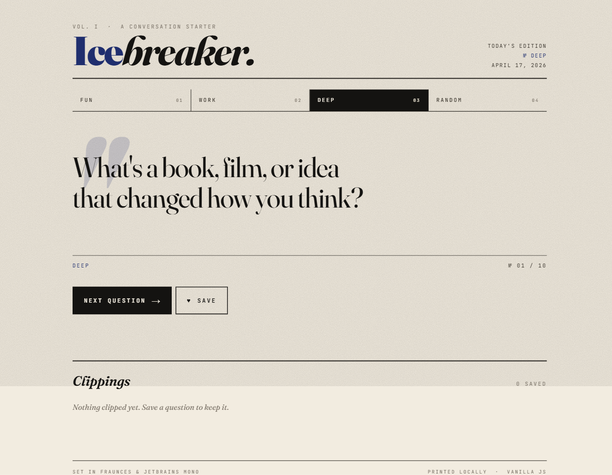

# Icebreaker

A tiny single-page web app that serves up random icebreaker questions across four categories: **Fun**, **Work**, **Deep**, and **Random**. Pick a category, hit *Next Question*, and save the ones you like — favorites persist in `localStorage`. Set like a small editorial in Fraunces & JetBrains Mono, with a per-category accent that shifts across the layout.



## Live demo

Deployed via GitHub Pages: <https://lnsadani.github.io/icebreaker/>

## Running locally

No build step, no dependencies. Just open `index.html` in a browser, or serve the folder:

```bash
npx http-server -p 8765
```

Then visit <http://127.0.0.1:8765/>.

## Files

- `index.html` — the app (published to GitHub Pages)
- `icebreaker.html` — working copy / development version

## Tech

Plain HTML, CSS, and vanilla JavaScript. No frameworks.
